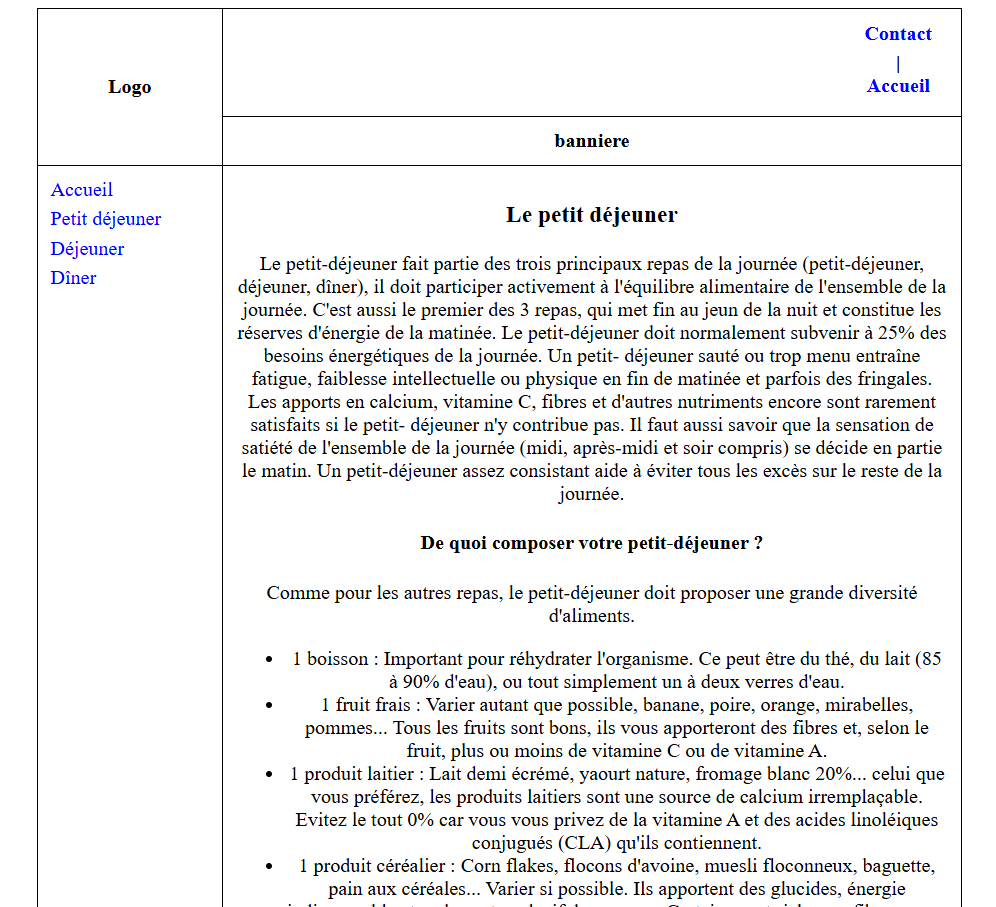
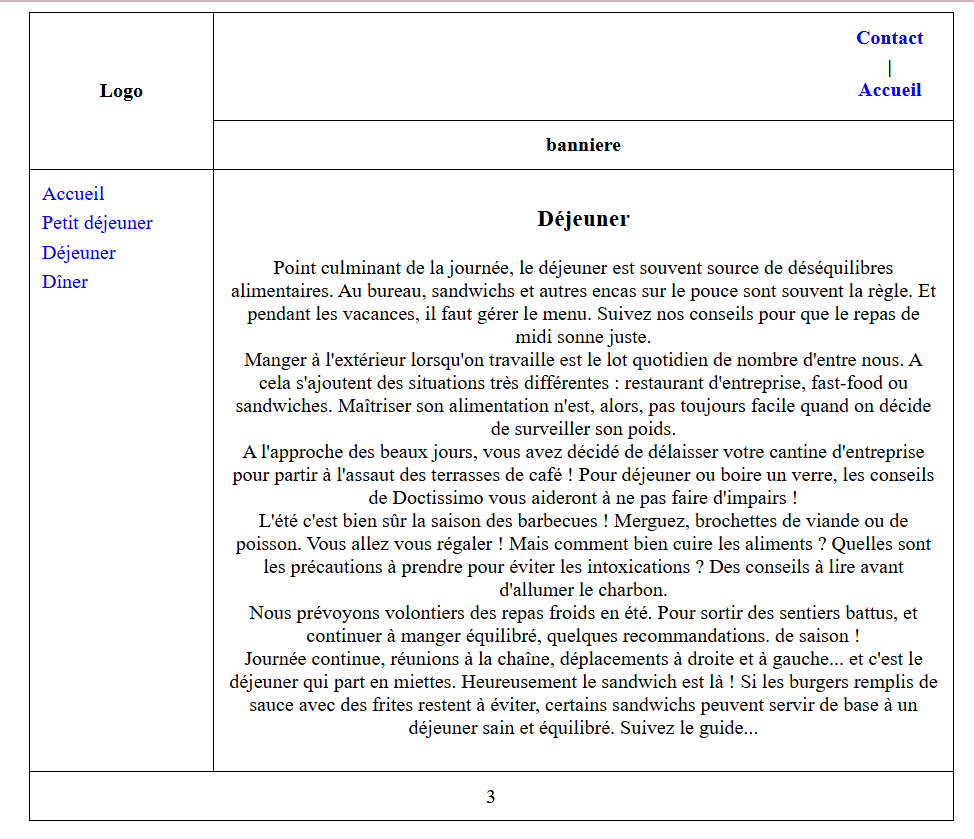
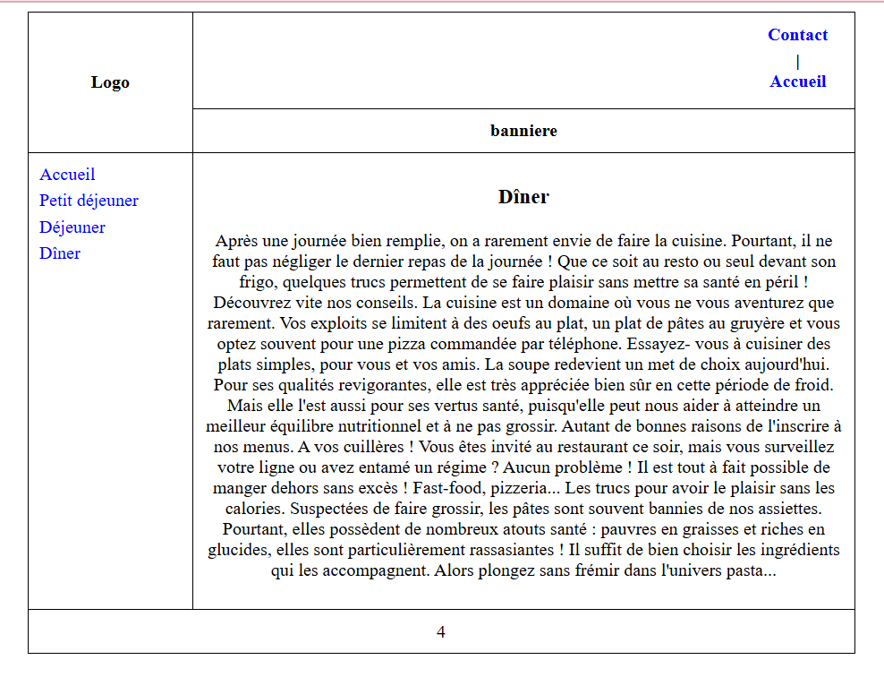

# TP1 📂 : Creating an HTML Website with Table-Based Layout

## 📌 Description
This project is an exercise in creating a **website using HTML**, utilizing **tables** to organize the layout. The site consists of **four main pages** and a template file (gabari.html) to ensure a uniform structure.  

## 📄 Website Pages
1. **Index.html**: Home page  
2. **Petit-dejeuner.html**: Page describing breakfast  
3. **Dejeuner.html**: Page describing lunch  
4. **Diner.html**: Page describing dinner  

Each page is built using the gabari.html template, which includes:  
✅ A logo  
✅ A left-side navigation menu  
✅ A top banner  
✅ A central content area  
✅ A footer  

---

### 🏠 **Home Page **
  
🔎 The home page displays a menu on the left and a banner at the top. The main content is centered.  

### 🍞 **Breakfast Page (petit-dejeuner.html)**
  
🔎 This page describes breakfast elements with a similar layout.  

### 🍽️ **Lunch Page (dejeuner.html)**
  
🔎 The Lunch page presents different meal options with text .  

### 🌙 **Dinner Page (diner.html)**
  
🔎 This page is dedicated to the evening meal, with details and illustrations.  

---

## 🛠️ Technologies Used
- **HTML**: Website structure  
- **Git/GitHub**: Version control  

---

## 💌 Author
👩‍💻 RIM AALOI  
💌 Contact: aaloirim@gmail.com 

---

## 📢 Notes
🔹 The site is optimized for a **800x600 pixel resolution** with a width of **740 pixels**.  
