# TP3📂 : Introduction à JavaScript — Exercices — Types simples, variables et instructions de base

## 📌 Description
This project is a collection of **JavaScript exercises** designed to practice fundamental programming concepts. Each exercise focuses on a specific task, such as temperature conversion, sorting numbers, displaying patterns, and calculating Fibonacci sequences. The results are displayed interactively in the browser using `alert` and `prompt`.

---

## 📄 Exercises Overview
1. **Temperature Conversion**: Converts Fahrenheit to Celsius.
2. **Duration Conversion**: Converts seconds into days, hours, minutes, and seconds.
3. **Sorting Numbers**: Sorts three numbers in ascending order.
4. **Pattern Display - Stairs**: Displays a triangular pattern using `while` and `for` loops.
5. **Pattern Display - Pyramid**: Displays a centered pyramid pattern.
6. **Prime Number Check**: Determines if a number is prime.
7. **Fibonacci Sequence**: Calculates the nth term or finds the first term exceeding a given value.
8. **Square Root Approximation**: Approximates the square root of a number using an iterative method.

---

## 📸 Screenshots
Here are some screenshots to illustrate the exercises:

### 🌡️ **Temperature Conversion (Exercise 1)**
Converts Fahrenheit to Celsius.

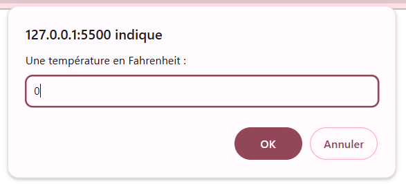  
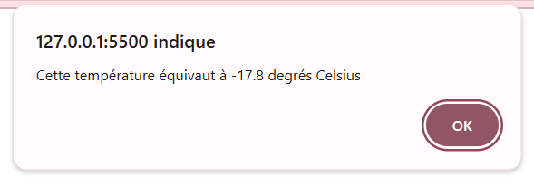 

### ⏱️ **Duration Conversion (Exercise 2)**
Converts seconds into days, hours, minutes, and seconds.

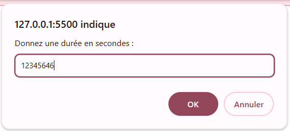
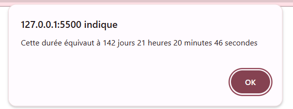

### 🔢 **Sorting Numbers (Exercise 3)**
Sorts three numbers in ascending order.

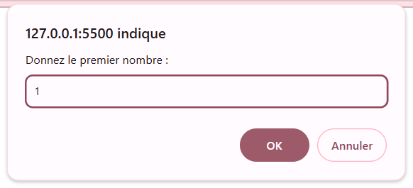  
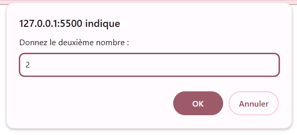  
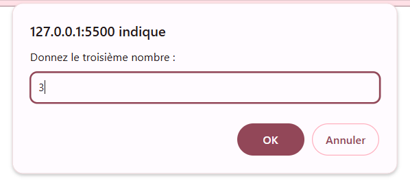 
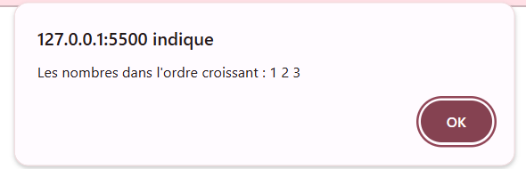  

### 🎨 **Pattern Display - Stairs (Exercise 4)**
🔎 Displays a triangular pattern using loops.

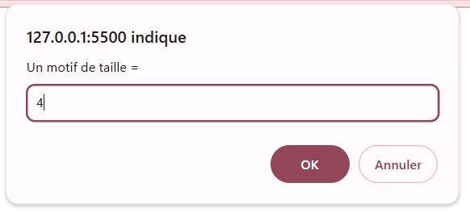 
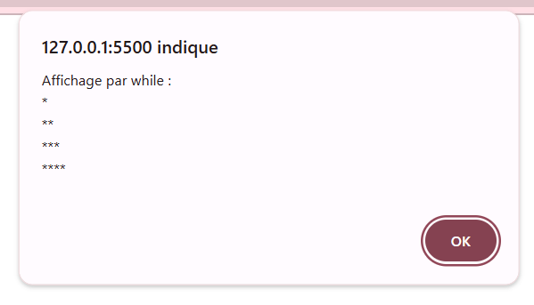
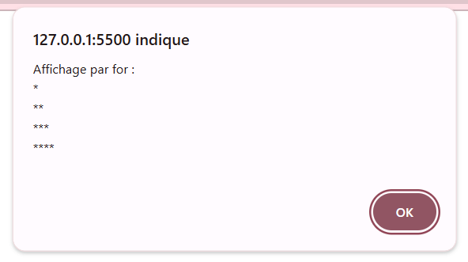

### 🏰 **Pattern Display - Pyramid (Exercise 4-bis)**
Displays a centered pyramid pattern.

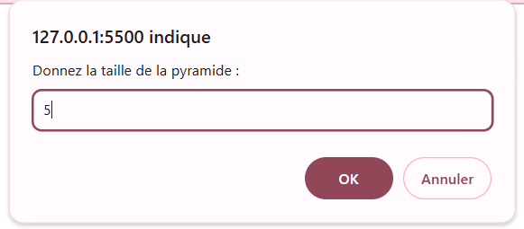  
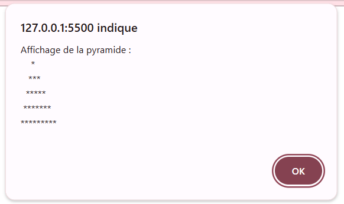 

### 🔍 **Prime Number Check (Exercise 5)**
Checks if a number is prime.

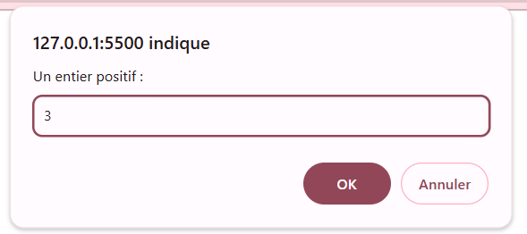  
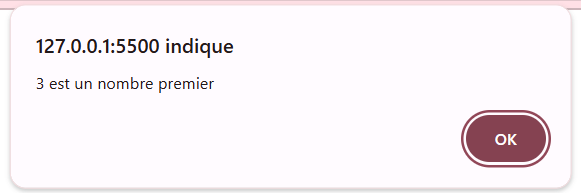  

### 🌀 **Fibonacci Sequence (Exercise 6)**
Calculates Fibonacci terms or finds the first term exceeding a value.

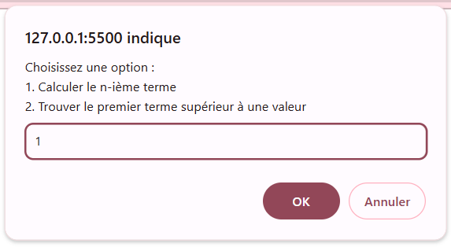  
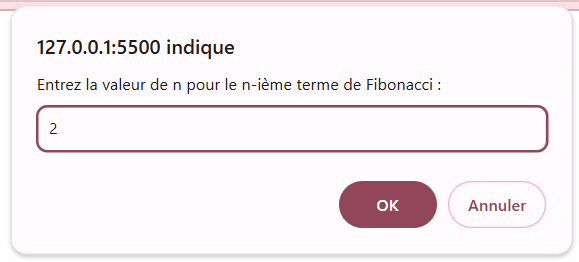 
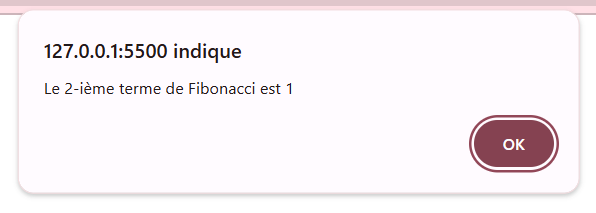 
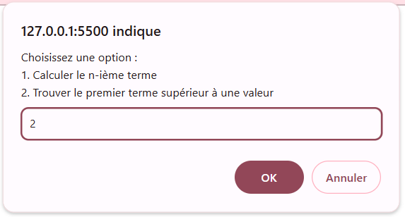
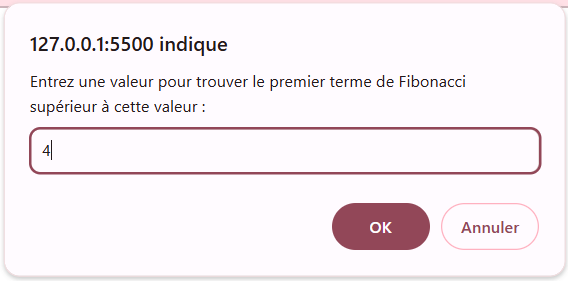
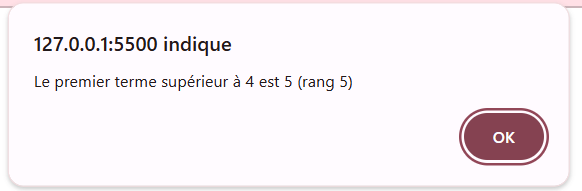 

### 📏 **Square Root Approximation (Exercise 7)**
Approximates the square root of a number.

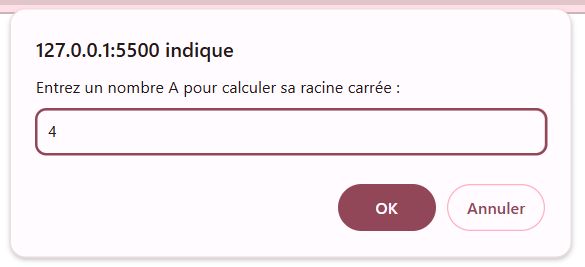
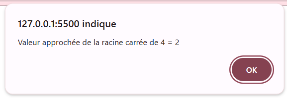

---

## 🛠️ Technologies Used
- **HTML**: Basic structure for running JavaScript in the browser.
- **JavaScript**: Core logic for all exercises.
- **Git/GitHub**: Version control and project hosting.

---

## 💌 Author
👩‍💻 **Rim Aaloi**  
💌 Contact: [GitHub Profile](https://github.com/RimAaloi) | [LinkedIn](https://www.linkedin.com/in/rim-aaloi/)  

---

## 📢 Notes
🔹 All exercises are interactive and use `prompt` for input and `alert` for output.   
🔹 Feel free to modify and expand the exercises as needed.  
