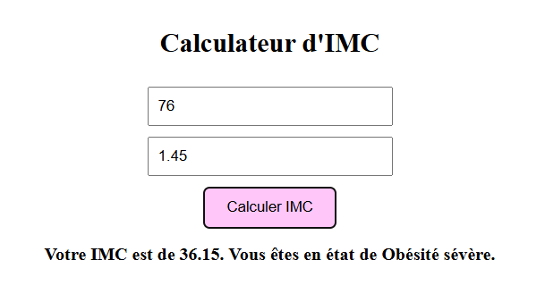

# 📂 Web Development Exercises

This project is a web-based application that includes four interactive tools: a **simple calculator** for basic arithmetic operations, a **value swapper**, a **BMI calculator**, and a **scientific calculator** with advanced functions like square root, trigonometry, and logarithms. 

---

## 🛠️ Tools Included

1. **Simple Calculator**: Performs basic arithmetic operations (addition, subtraction, multiplication, division).
2. **Value Swapper**: Swaps the values of two input fields.
3. **BMI Calculator**: Calculates Body Mass Index (BMI) and provides an interpretation of the result.
4. **Scientific Calculator**: Supports advanced functions like square root, trigonometry (sin, cos, tan), logarithms, and exponentiation.

---

## 🚀 Features
- **Interactive Design**: Each tool is user-friendly and responsive.
- **Dynamic Results**: Results are displayed in real-time using JavaScript.
- **Clean UI**: Styled with CSS for a modern and intuitive interface.

---

## 💻 Technologies Used
- **HTML**: For structuring the web pages.
- **CSS**: For styling and layout.
- **JavaScript**: For interactivity and dynamic functionality.

---

## 📸 Screenshots

### 🖼️ **Value Swapper**
*Swaps values between two input fields.*

  
.png) 

### 🖼️ **Simple Calculator**
*Basic arithmetic operations.*

.png)
.png)  

### 🖼️ **BMI Calculator**
*Calculates BMI and provides health interpretation.*

  

### 🖼️ **Scientific Calculator**
*Supports advanced mathematical functions.*

.png)  
.png)  

---
## 🛠️ How to Use
1. Clone the repository or download the files.
2. Open `index.html` in your browser.
3. Interact with the tools to perform calculations, swap values, or compute BMI.

---

## 💌 Author
👨‍💻 **RIM AALOI**  
💌 Contact: [GitHub Profile](https://github.com/YourProfile) | [LinkedIn](https://www.linkedin.com/in/YourProfile/)  

---

## 📢 Notes
🔹 These exercises are designed to strengthen foundational web development skills.

🔹 You can use these files as a starting point for your own projects.

🔹 Feel free to explore and modify the code to better understand how it works.

